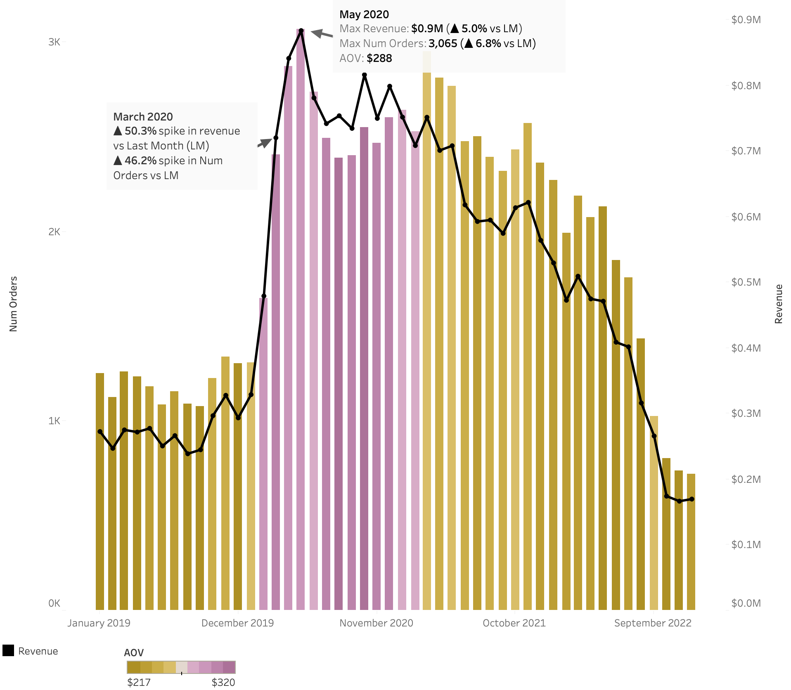

# E-Galaxy Sales Performance Analysis

#### End-to-End Data Analysis

  

 

**E-Galaxy** is a global e-commerce company specializing in electronics products like laptops, smartphones, headphones, and accessories from leading brands like **Apple**, **Samsung**, **Lenovo**, and **Bose**. Founded in 2018, the company operates through web and mobile platforms.

This project performs a comprehensive analysis of **sales data from 2019 to 2022**, covering ~88K customers and ~93K transactions. The goal is to evaluate business performance across revenue, orders, product profitability, refunds, loyalty programs, and regional demand, then deliver **actionable insights** to support cross-functional teams (Sales, Marketing, Operations, Inventory, and Product).

 Data & Tech Info 

**Tech Stack**: Python, Pandas, NumPy, Matplotlib, Seaborn, Tableau, Excel

Key Stakeholder Questions

E-Galaxy wants to better understand their performance and any growth opportunities.
 

**Business Questions Answered:**
- How have **revenue**, **number of orders**, and **Average Order Value (AOV)** trended over time?
- Which **products and brands** drive the most revenue, and which have the highest refund rates?
- How effective is the **Loyalty Program**? Should it be expanded or optimized?
- What are the differences in demand across **regions and countries**?
- How efficient is the **delivery process**, and where can operational improvements be made?
- What recommendations can improve **inventory management**, **marketing ROI**, and **customer experience**?

 Data & Tech Info 

- **Data Processing & Analysis**: Python, Pandas, NumPy, Excel
- **Visualization**: Matplotlib, Seaborn
- **Dashboarding**: Tableau (primary) + Power BI (exploratory)

[**View Tableau Dashboard**](https://public.tableau.com/views/E-Galaxy/Dashboard1?:language=en-US&publish=yes&:sid=&:redirect=auth&:display_count=n&:origin=viz_share_link)

## Executive Summary

  

 

Revenue grew by **165%** with **100% increase in orders from 2019 to 2020**, driven by Covid-19 pandemic related shifts in consumer behavior, including increased e-commerce activity and work from home trends. In **2021**, order volume continued to rise by **6%** but average order value decline that led to **10% drop in revenue** signalling a shift toward lower value purchases. Revenue has steadily declined from **2020 to 2022**. This downward trend has accelerated between **2021 and 2022** with **orders decreasing by 38%, revenue falling by 44%** and **AOV dropping by 10%** highlighting weakening demand and reduced customer engagement.

  

Peak Sales Occured in **May 2020**, when monthly revenue reached approximately **$1M** reflecting the pandemic driven e-commerce boom.

**Key Insights**
- **Revenue is primarily volume driven**. Changes in revenue closely follows fluctuations in order volume rather than AOV.
- **AOV remained relatively stable** ranging from **$217 to $320**. This reflects no significant contribution to revenue volatility.
- **Demand decline in 2022 is structrural**. The sharp drop in order suggests challenges in **customer acquisition, retention, or purchase frequency**, rather than pricing issues alone.

**Recommendations**
- **Boost AOV** through pricing optimization, product bundling, and upselling strategies
- **Rebuild demand** by investing in customer acquisition and retention initiatives
- **Investigate behavioral shifts** post pandemic to realign product offerings with current consumer preferences.
