# E-Galaxy Sales Performance Analysis

#### End-to-End Data Analysis

  

 

**E-Galaxy** is a global e-commerce company specializing in electronics products like laptops, smartphones, headphones, and accessories from leading brands like **Apple**, **Samsung**, **Lenovo**, and **Bose**. Founded in 2018, the company operates through web and mobile platforms.

This project performs a comprehensive analysis of **sales data from 2019 to 2022**, covering ~88K customers and ~93K transactions. The goal is to evaluate business performance across revenue, orders, product profitability, refunds, loyalty programs, and regional demand and finally deliver **actionable insights** to support cross-functional teams (Sales, Marketing, Operations, Inventory, and Product).

Key Stakeholder Questions

E-Galaxy wants to better understand their performance and any growth opportunities.

- How have **revenue**, **number of orders**, and **Average Order Value (AOV)** trended over time?
- Which **products and brands** drive the most revenue, and which have the highest refund rates?
- How effective is the **Loyalty Program**? Should it be expanded or optimized?
- What are the differences in demand across **regions and countries**?
- How efficient is the **delivery process**, and where can operational improvements be made?
- What recommendations can improve **inventory management**, **marketing**, and **customer experience**?

 Data & Tech Info 

- **Data Processing & Analysis**: Python, Pandas, NumPy, Excel, SQL
- **Visualization**: Matplotlib, Seaborn, Plotly
- **Dashboard**: Tableau (explored with Power BI desktop as well)

[**View Tableau Dashboard**](https://public.tableau.com/views/E-Galaxy/ExecutiveSummary?:language=en-US&publish=yes&:sid=&:redirect=auth&:display_count=n&:origin=viz_share_link)

## Executive Summary
### Sales Performance Overview (2019-2022)
This section analyzes overall performance using monthly revenue trends, order volume, and average order value (AOV). The goal is to identify **revenue trends** and **provide data driven recommendations**.

 <b>Click for details and figures</b>

>
><table>
><tr>
>	<b>Table 1.</b> Annual Sales Performance Summary showing yearly sales revenue, number of orders, and average order value (AOV), including year-over-year (YoY) growth rates for each metric.
></tr>
><tr align="center";>
>  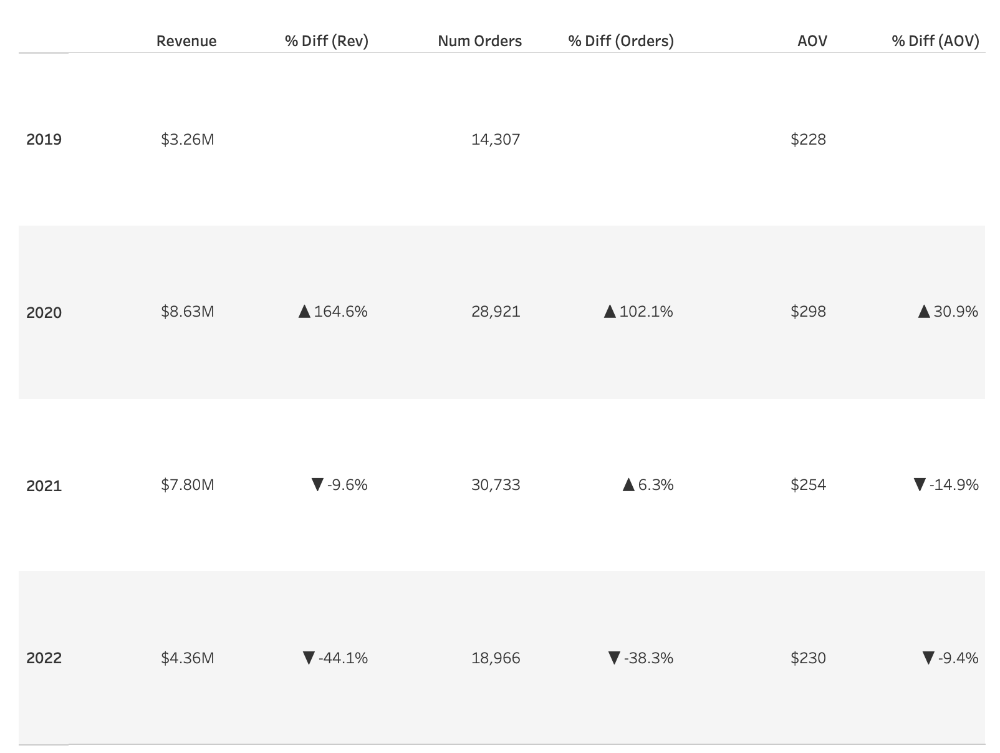
></tr>
></table>
>

**Table 1** shows sales revenue grew by **165%** with **102% increase in orders from 2019 to 2020**, driven by Covid-19 pandemic related shifts in consumer behavior, including increased e-commerce activity and work from home trends. In **2021**, order volume continued to rise by **6%** but average order value decline that led to **10% drop in revenue** signalling a shift toward lower value purchases. Revenue has steadily declined from **2020 to 2022**. This downward trend has accelerated between **2021 and 2022** with **orders decreasing by 38%, revenue falling by 44%** and **Avg Order Value (AOV) dropping by 9%** highlighting weakening demand and reduced customer engagement.

>
><table>
><tr align="center">
>  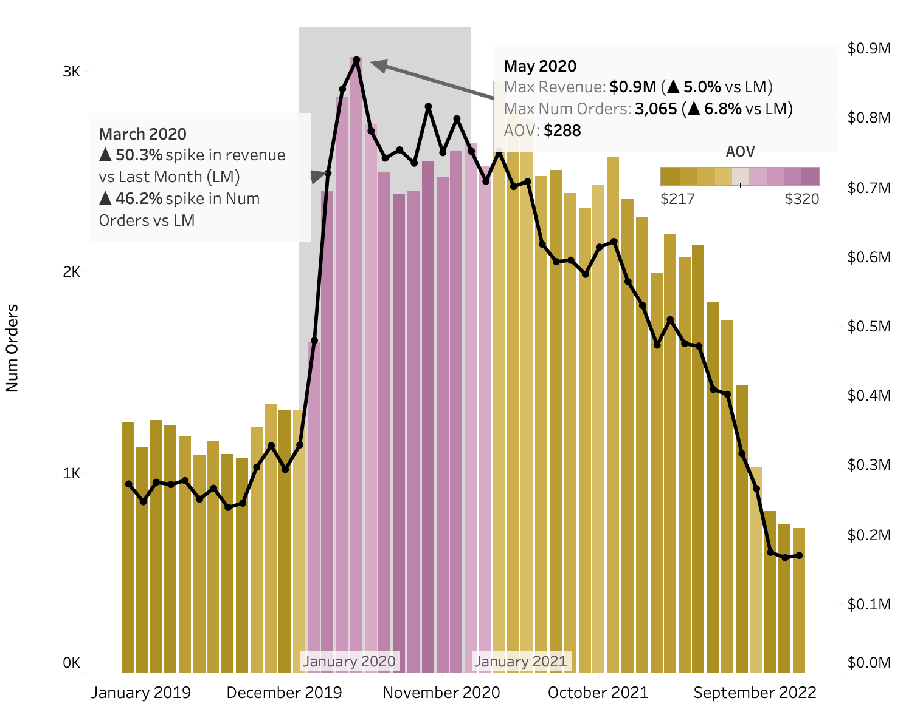
></tr>
><tr>
>	<b>Fig. 1. </b> Monthly Sales Revenue Trends. The black line represents monthly sales revenue. Bar height shows the number of orders, while color (gold to purple) reflects the strength of AOV ranging from $217 to $320. Annotations higlights the month with the highest Revenue and the month with highest month-over-month growth rate. The grey shaded area highlights 2020 during which the revenue, order volume, and AOV peaked.
></tr>
></table>
>

**Fig. 1** shows monthly revenue and order dynamics where sales revenue peaked in **May 2020** and monthly revenue reached approximately **$1M** reflecting the pandemic driven e-commerce surge. This was accompanied by increased num of orders. **March 2020** showed the highest monthly growth rate of **50%** compared to previous month. The purple bars patch is concentrated between January 2020 and Q1 of 2021 reflecting peak AOV, order volume, and sales revenue.

>
><table>
><tr align="center">
>  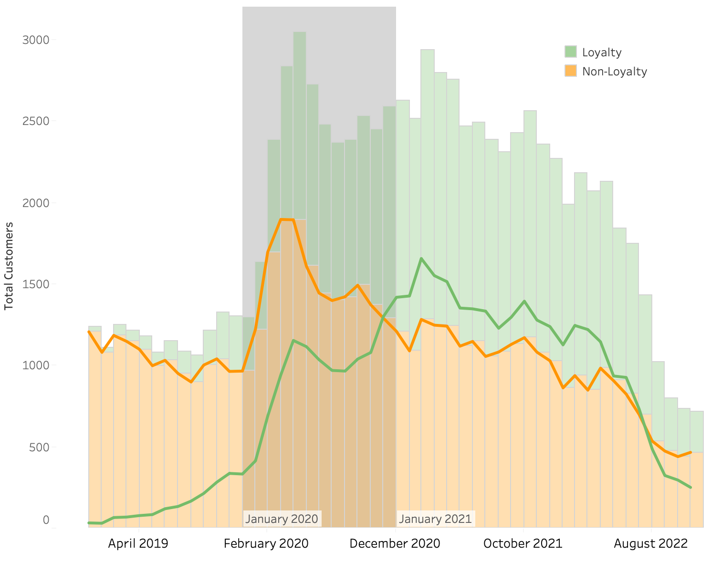
></tr>
><tr>
>  <b>Fig. 2. </b> Monthly  Customer  Trends by loyalty status. Green represents loyalty members and orange represents non-loyalty customers. The grey shaded area highlights 2020 during which non-Loyalty customers peaked while loyalty membership increased significantly. 
></tr>
></table>
>

**Fig. 2** shows monthly customer trends segmented by loyalty status. Non-Loyalty customers were the primary drivers of growth between 2019 and 2021 with  a sharp surge in non-loyalty customers that peaked in May 2020. 

Since 2020, there is a notable shift to loyalty membership. Loyalty customers have increased significantly throughout 2020, eventually surpassing non-loyalty customers by the end of the year and  peaked in Feb 2021. This indicates successful conversion and retention. Both customer segments have stabilized in 2021 suggesting a plateau in customer expansion and engagement. However, beginning in April 2022, both loyalty and non-loyalty customers count  have sharply declined mirroring drop in orders and revenue (Fig. 1). This implies a contraction in the whole customer base rather than an isolated segment issue.

**Key Insights**
- **Revenue is primarily volume driven**. Changes in revenue closely tracks changes in order volume rather than AOV.
- **AOV remained relatively stable** within a narrow band of **$217-$320** contributing minimally to revenue volatility.
- **Post-peak normalization** as demand patterns indicate a reversion following pandemic-driven boom.
- **Customer shifted toward loyalty memberships** post 2020, reflecting improved retention and membership adoption.
- **Sharp drop in 2022 orders is structural** with reductions across both customer segments singaling deeper demand challenges. 
- **Further deep analysis required**

**Recommendations**
- **Increase AOV** through bundling, upselling, and pricing optimization strategies
- **Rebuild Customer demand** by strenghtening customer acquisition and retention programs, particularly within the loyalty segment.
- **Analyze behaviour of loyalty members** to identify opportunities for increasing purchase frequency and lifetime value
- **Reassess customer behaviour** by analyzing post-pandemic shifts to realign product offerings and marketing strategy

## Deeper Insights
### Product Performance Analysis
This section analyzes product level performance using monthly revenue trends, product contribution (Pareto analysis), and order volume vs revenue segmentation. The goal is to identify **high impact products**, **uncover inefficiencies**, and **provide data driven recommendations**.

 <b>Click for details and figures</b>

>
> <table width="100%">
>   <tr>
>     <td align="center" width="50%">
>       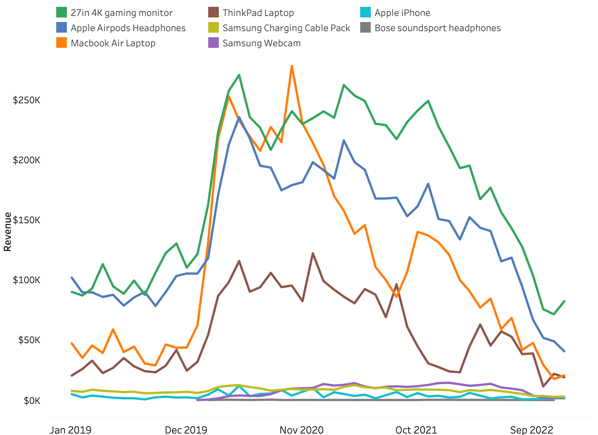 
>     </td>
>     <td align="center" width="50%">
>       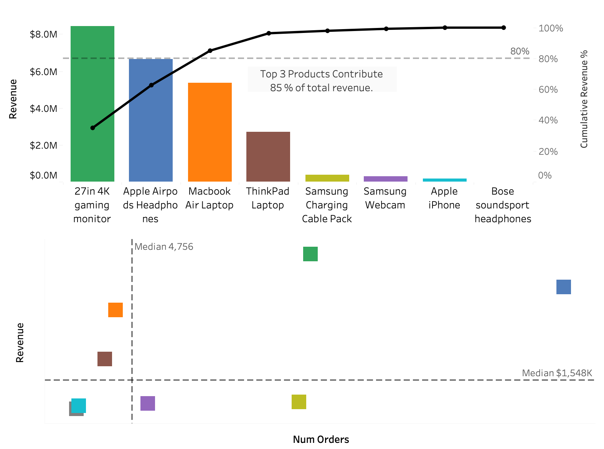 
>     </td>
>   </tr>
>   <tr>
>     <td colspan="2">
>       <b>Fig. 3a.</b> Monthly revenue trends segmented by product. <b>3b.</b> Product Contribution and Segmentation Analysis. <b>Top row:</b> Pareto analysis of product revenue contribution. The grey reference line represents the 80% cumulative revenue threshold. <b> Bottom row:</b> Product segmentation to four quadrants based on median revenue (horizontal grey lines) and median order volume (vertical grey lines)
></td></tr>
> </table>
>

**Fig. 3a.** shows the monthly revenue trends segmented by products. Among the eight products, 27in 4k Gaming Monitor, Apple Airpods, and MacBook Air  are the top products driving revenue throughout 2019 to 2022. Parteo Analysis (**Fig. 3b. [top row]**) showed that these products contribute 85% of the total revenue. Thinkpad laptop also delivered about **11%** of total revenue.  All these four products peaked in the pandemic driven market sugre through out 2020 and stared declining after pandemic driven market.

**Fig. 3b [bottom row]** shows the product segmentation analysis using median of the revenue and order volume into four quadrants as follows.
| Segment          | Characteristics                  | Products                                      |
|------------------|----------------------------------|-----------------------------------------------|
| **Star**         | High revenue + High volume (HH)      | Apple AirPods, 27in 4K Gaming Monitor     |
| **Volume Drivers** | Low revenue + High volume (LH)      | Samsung accessories (charging cables, webcams) |
| **Premium**      | High revenue + Low volume (HL)       | MacBook Air Laptop, ThinkPad Laptop          | 
| **Underperformers** | Low revenue + Low volume (LL)     | Apple iPhone, Bose SoundPort                 |

 The scatter plot showed that Apple Airpods are the most selling products followed by 27in 4k Gaming Monitor. These two are well inside the High revenue, High order volume (HH) quadrants and are the **Star products**. Samsung brands accessories like charging cables and webcams are the **Volume drivers** with low revenue but high order volume (LH). Laptops (MacBook Air and ThinkPad) are the **premium products** with high revenue but low order volume(HL). MacBook Air is  near the borderline of star products. Both premium products have high refund rate of **>11%**. Apple Iphones and Bose headphones are **Underperformers** with low volume and low revenue (LL). Although underperformers, Apple Iphone has high AOV of **$743** but still high refund rate of **8%**. 

 **Key Insights**
- Revenue is primarily driven by top three products.
- **27 in 4K gaming monitor and Apple AirPods** are the star produts 
- Premium product **Laptops** have high refund rate of **>11%**
- **Samsung accessories** are volume drivers
- **2022 shows 0 refunded products**. This is likely a data completness issue.  

 **Recommendations**
- Priortitize star  products these products are star products and ideal for targeted promotion
- depriortizie bose soundport or reassessed for repositioning
- Macbook Air and Thinkpad are premium products with high refund rates. High return trates may indicate product misalignment of fulfillment isses that warrant investigation and intervention.
- Further investigation to fill gap as this missing data for such large period limits visibility into product performance and impacts refund trend modeling, inventory planning, and loss prevention.

### Customer, Geographic, Marketing, and Operational

 <b>Click for details and figures (in Progress)</b>

### Customer Performance by Loyalty Membershipb

>
> <table width="100%">
>   <tr>
>     <td align="center" width="50%">
>       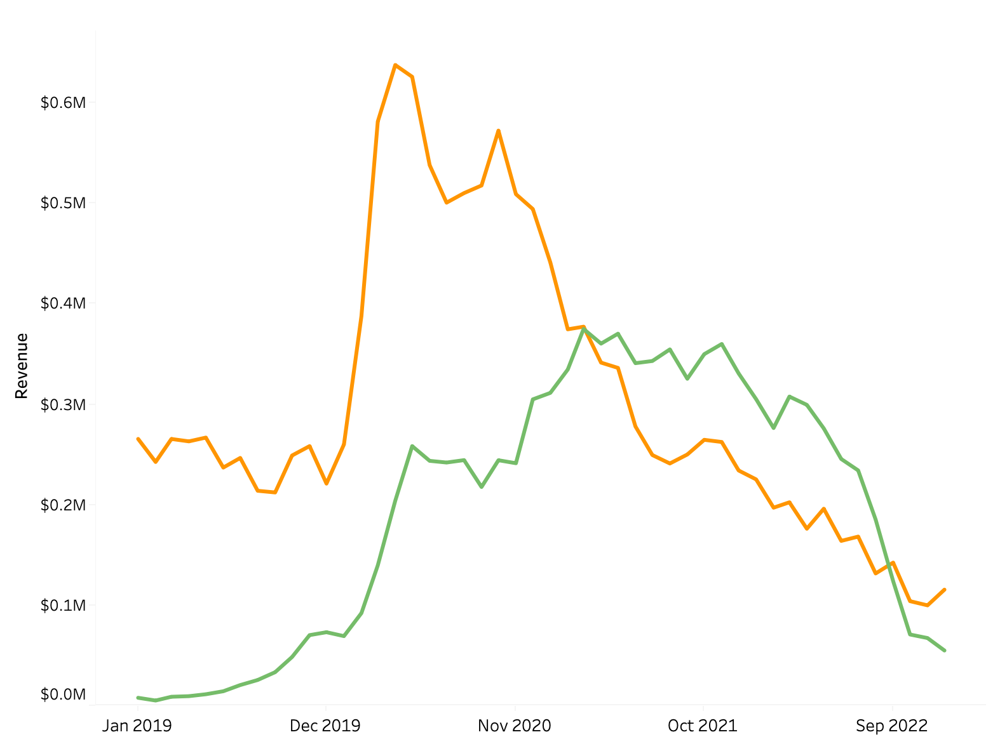 
>     </td>
>     <td align="center" width="50%">
>       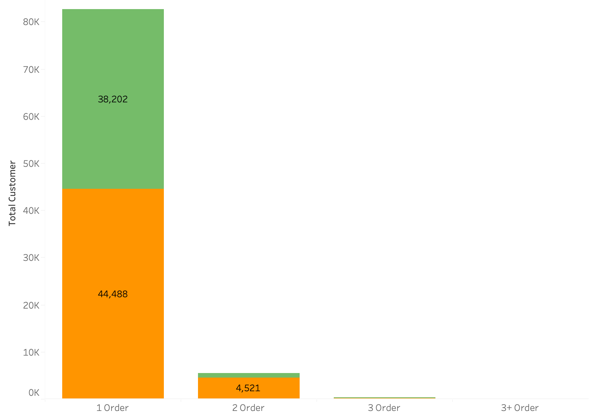 
>     </td>
>   </tr>
>   <tr>
>     <td colspan="2">
>       <b>Fig. 4a.</b>  <b>4b.</b> 
></td></tr>
> </table>
>

### Geographic Performance

>
> <table width="100%">
>   <tr>
>     <td align="center" width="50%">
>       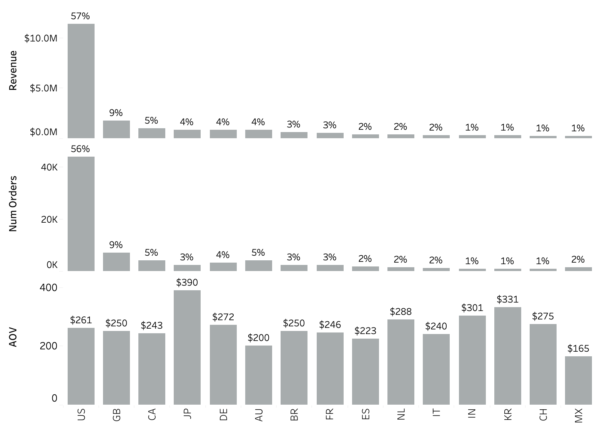 
>     </td>
>     <td align="center" width="50%">
>       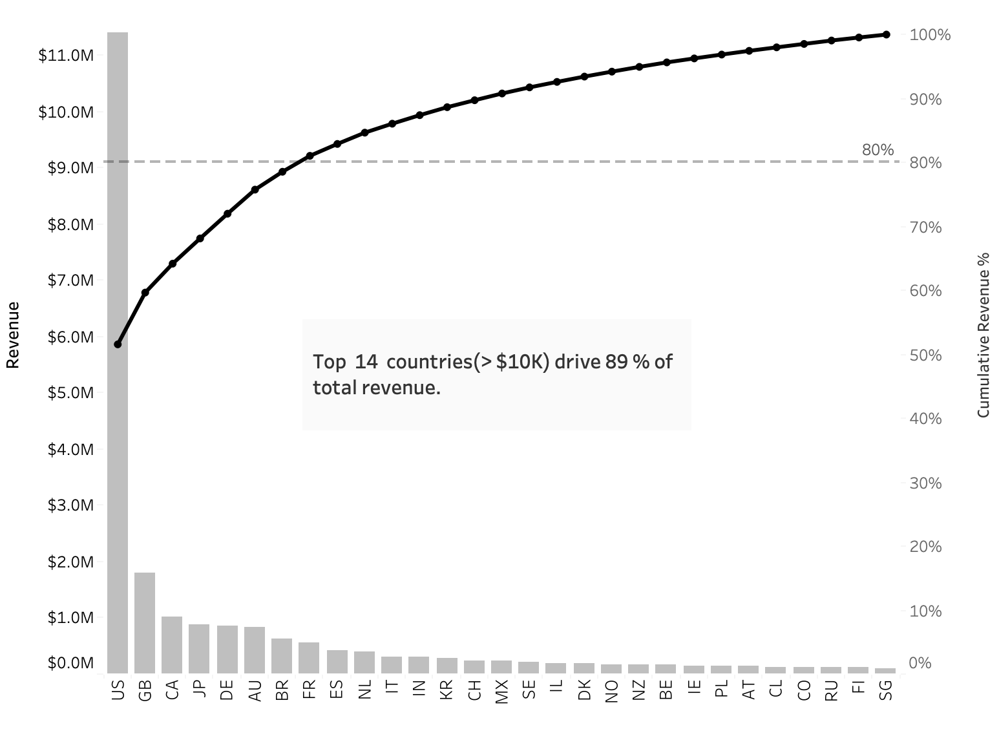 
>     </td>
>   </tr>
>   <tr>
>     <td colspan="2">
>       <b>Fig. 5a.</b>  <b>5b.</b> 
></td> </tr>t
> </table>
>

>
> <table width="100%">
>   <tr>
>     <td align="center" width="50%">
>       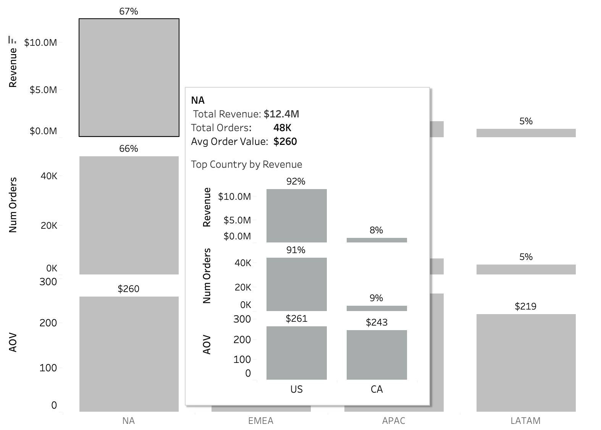 
>     </td>
>     <td align="center" width="50%">
>       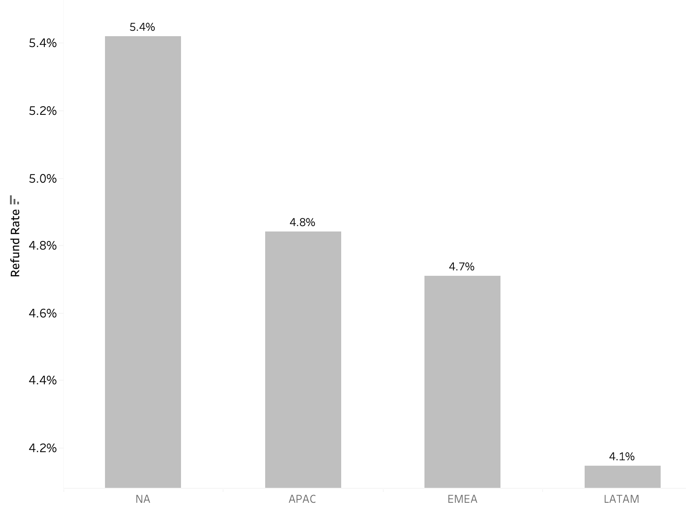 
>     </td>
>   </tr>
>   <tr>
>     <td colspan="2">
>       <b>Fig. 6a.</b>  <b>6b.</b> 
></td></tr>
> </table>
>

### Marketing Channel Performance

>
> <table width="100%">
>   <tr>
>     <td align="center" width="50%">
>       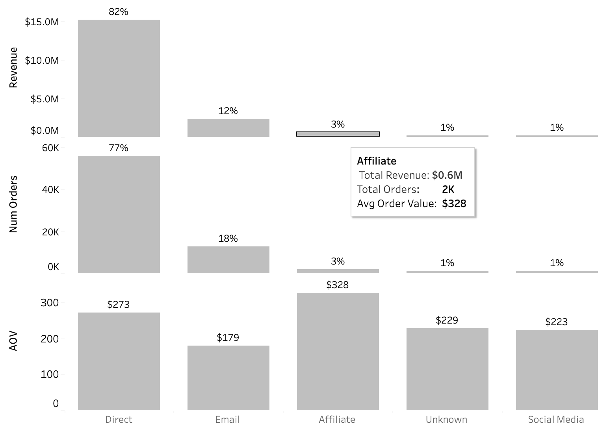 
>     </td>
>     <td align="center" width="50%">
>       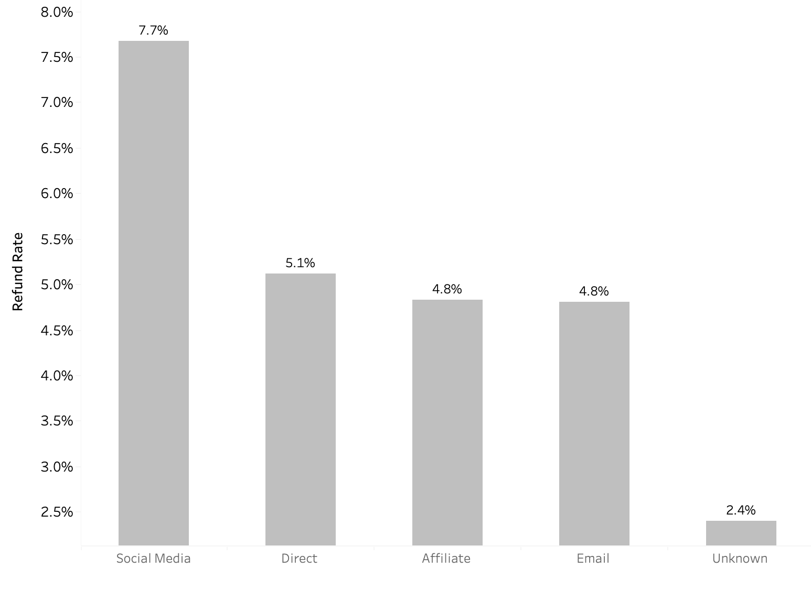 
>     </td>
>   </tr>
>   <tr>
>     <td colspan="2">
>       <b>Fig. 8a.</b>  <b>8b.</b> 
></td></tr>
> </table>
>

### Operational Performance

>
> <table width="100%">
>   <tr>
>     <td align="center" width="50%">
>       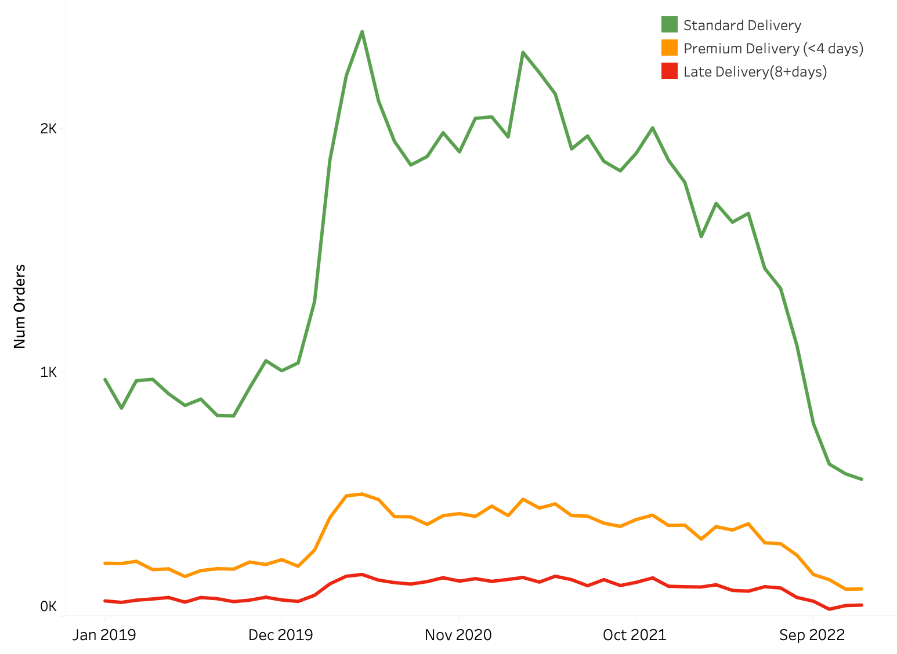 
>     </td>
>     <td align="center" width="50%">
>       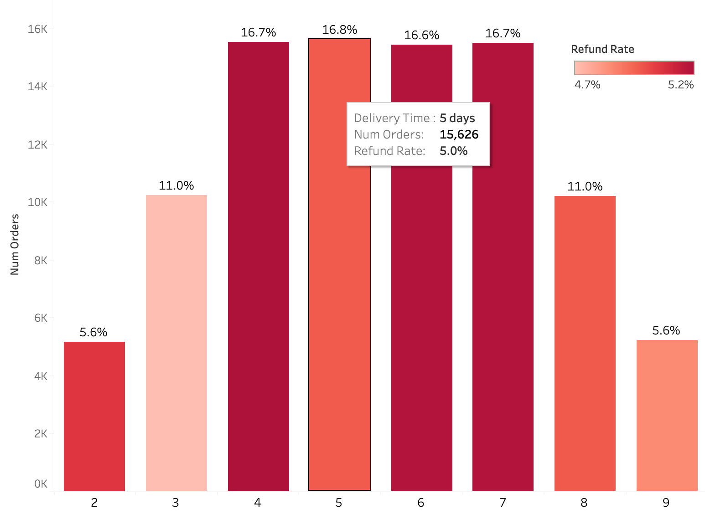 
>     </td>
>   </tr>
>   <tr>
>     <td colspan="2">
>       <b>Fig. 9a.</b>  <b>9b.</b> 
></td></tr>
> </table>
>

